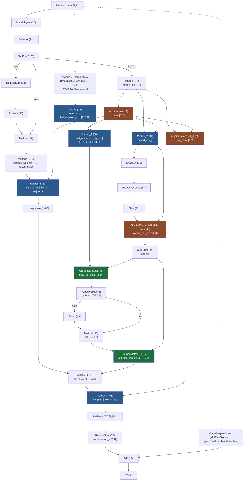
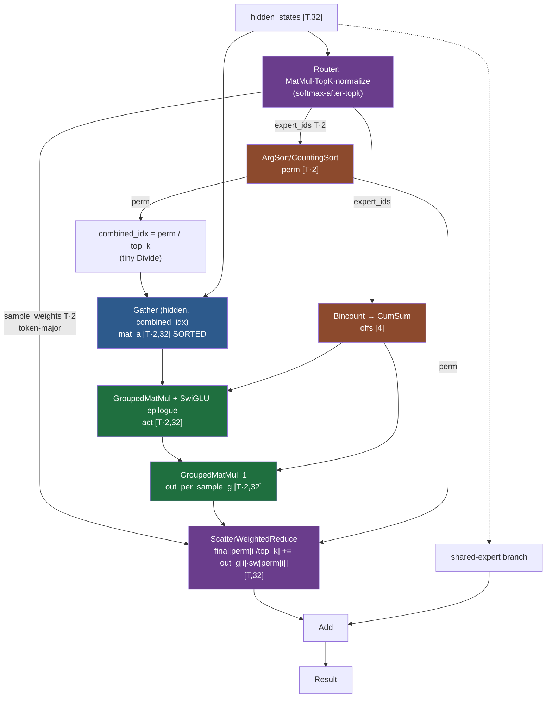

# MoE Computation on Intel GPU — GatherMatmul vs. Fused MoE vs. GroupedMatMul

A structural analysis of three ways to express and execute the Mixture-of-Experts (MoE)
block on the OpenVINO Intel GPU plugin, focused on **repacking** (gather/scatter/sort
traffic) rather than raw GEMM throughput.

The three approaches:

1. **GatherMatmul** — a single-GEMM primitive instantiated 3× (gate / up / down), with
   indices of activated experts as a third input.
2. **Fused MoE** — the `moe_3gemm_fused_compressed` composite kernel.
3. **GroupedMatMul** — `opset17::GroupedMatMul`, where repacking is expressed directly in
   the graph around the GEMMs.

Reference sources:
- [gather_matmul_gen_micro.cpp](src/plugins/intel_gpu/src/graph/impls/ocl_v2/gather_matmul/gather_matmul_gen_micro.cpp),
  [gather_matmul.cpp](src/plugins/intel_gpu/src/graph/impls/ocl_v2/gather_matmul/gather_matmul.cpp)
- [gather_matmul.cl](src/plugins/intel_gpu/src/graph/impls/ocl_v2/gather_matmul.cl),
  [gather_matmul_batched.cl](src/plugins/intel_gpu/src/graph/impls/ocl_v2/gather_matmul_batched.cl),
  [gathermatmul_sort.cl](src/plugins/intel_gpu/src/graph/impls/ocl_v2/gathermatmul_sort.cl),
  [gathermatmul_gather.cl](src/plugins/intel_gpu/src/graph/impls/ocl_v2/gathermatmul_gather.cl),
  [gathermatmul_scatter.cl](src/plugins/intel_gpu/src/graph/impls/ocl_v2/gathermatmul_scatter.cl)
- [moe_3gemm_swiglu_opt.cpp](src/plugins/intel_gpu/src/graph/impls/ocl_v2/moe/moe_3gemm_swiglu_opt.cpp),
  [moe_gather_ref.cl](src/plugins/intel_gpu/src/graph/impls/ocl_v2/moe_gather_ref.cl),
  [moe_scatter_reduction_opt.cl](src/plugins/intel_gpu/src/graph/impls/ocl_v2/moe_scatter_reduction_opt.cl)
- [moe.cpp](src/plugins/intel_gpu/src/plugin/ops/moe.cpp)
- [convert_grouped_matmul_to_gather_matmul.cpp](src/common/transformations/src/transformations/op_conversions/convert_grouped_matmul_to_gather_matmul.cpp),
  [grouped_matmul.hpp](src/core/reference/include/openvino/reference/grouped_matmul.hpp)
- PR #35215 ("[Op] GroupedMatMul init")

---

## 1. Fused MoE primitive vs. GatherMatmul MoE comparison

### GatherMatmul — a single-GEMM primitive used three times

`gather_matmul` computes `out[slot, token, :] = A[token,:] · W[expert_id(token,slot)]`.
In the MoE block it appears **three times** (gate, up, down). The router-weight `Multiply`,
`Unsqueeze` and `ReduceSum` (top-k combine) remain **separate ops outside the primitive**.

The impl has three execution paths, selected at runtime:

- **Path A — decode / single token** (`n_tokens ≤ 1`,
  [gather_matmul.cl:54-66](src/plugins/intel_gpu/src/graph/impls/ocl_v2/gather_matmul.cl#L54-L66)):
  one WG per `(token, expert_slot)`, pure pointer arithmetic into A and out.
  **No gather, no scatter, no sort.**
- **Path B — OCL batched prefill** (`n_tokens > 16`, u4/i4 weights): `bgm_sort` →
  `bgm_gather` (physical copy of activation rows into expert-contiguous `GATHERED_A`) →
  `gather_matmul_batched` with the **scatter fused into the GEMM epilogue**
  ([gather_matmul_batched.cl:103-113](src/plugins/intel_gpu/src/graph/impls/ocl_v2/gather_matmul_batched.cl#L103-L113)).
- **Path C — onednn-grouped prefill** (non-u4/i4, or env-gated): `onednn_sort` →
  `batched_gather` → `dnnl::grouped_matmul` (packed `[total,N]` output) → **separate
  `bgm_scatter` kernel** to expand back to token-major.

**The cost:** because each of the three ops is independent, prefill pays the gather/scatter
round-trip **per GEMM**:

| | gate | up | down |
|---|---|---|---|
| sort | ✓ | ✓ (redundant) | ✓ |
| gather (physical copy of A) | ✓ | ✓ (**same A re-gathered**) | ✓ (swiglu out) |
| scatter to token-major | ✓ | ✓ | ✓ |

→ **3× sort, 3× gather, 3× scatter**, plus a standalone `Multiply`/`ReduceSum` combine.
gate and up re-gather *identical* activations; the swiglu output is scattered to
token-major and then immediately re-gathered by the down op.

### Fused MoE — repacking done once

[moe.cpp:32-90](src/plugins/intel_gpu/src/plugin/ops/moe.cpp#L32-L90) builds one composite
primitive. Two runtime paths:

- **Small batch** (`token_num ≤ 32`): `exec_batched_gemv`
  ([moe_3gemm_swiglu_opt.cpp:1346](src/plugins/intel_gpu/src/graph/impls/ocl_v2/moe/moe_3gemm_swiglu_opt.cpp#L1346)).
  One WG per `(token, expert)`; gate·up·silu fused, then down + router-weight-multiply,
  then per-token reduce. **Repacking-free** — same idea as GatherMatmul Path A.
- **Prefill** (`exec_prefill_grouped_gemm`,
  [:2046](src/plugins/intel_gpu/src/graph/impls/ocl_v2/moe/moe_3gemm_swiglu_opt.cpp#L2046)):

  ```
  fused routing (softmax/sigmoid + topk)
  CPU mask-gen → upload offsets        ← GPU→CPU wait()
  gather (ONCE) → scratch.x  [total, hidden]
  grouped_matmul gate → scratch.gate   (stays packed)
  grouped_matmul up   → scratch.up     (stays packed, reuses scratch.x)
  swiglu (in place)   → scratch.gate   (packed, no repack)
  grouped_matmul down → scratch.y      (stays packed)
  scatter_reduce      → output         (weight-mul + top-k reduce + scatter fused)
  ```

  Two decisive differences in repacking:

  1. **Gather happens exactly once.** All three GEMMs consume the same expert-packed
     buffers via dnnl `grouped_memory` + `row_offsets`. Intermediates never leave the
     packed layout — no scatter-to-token-major + re-gather between GEMMs.
  2. **Output scatter is fused with the combine.**
     [moe_scatter_reduction_opt.cl:102-126](src/plugins/intel_gpu/src/graph/impls/ocl_v2/moe_scatter_reduction_opt.cl#L102-L126):
     one WG per output token reads its top-k packed rows, multiplies each by its router
     weight, accumulates in registers, single store. Collapses GatherMatmul's separate
     `scatter + Multiply + Unsqueeze + ReduceSum` into one kernel.

### Verdict (1)

| Aspect | GatherMatmul ×3 (prefill) | Fused moe_3gemm (prefill) |
|---|---|---|
| Sort / mask-gen | 3× (per op), GPU | 1×, **CPU mask-gen + `wait()`** |
| Activation gather | **3×** (gate & up re-gather same rows) | 1× |
| Layout between GEMMs | token-major → re-sorted each op | stays expert-packed |
| Output combine | scatter + separate Multiply + ReduceSum | **single fused** scatter_reduce |
| Routing/swiglu | separate ops | fused custom kernels |
| Small-batch path | indexed GEMV, no repack | indexed GEMV, no repack (equivalent) |

For prefill the fused kernel is structurally superior on repacking (~3× less packing
traffic, no token-major bounce around swiglu, fused combine). Its one structural
disadvantage is the **CPU mask-gen + `topk_event->wait()` GPU→CPU sync**
([:2347](src/plugins/intel_gpu/src/graph/impls/ocl_v2/moe/moe_3gemm_swiglu_opt.cpp#L2347)),
which can dominate at small prefill lengths. For decode, both are repack-free and
essentially equivalent.

---

## 2. GroupedMatMul MoE vs. the existing patterns

### What GroupedMatMul computes

`opset17::GroupedMatMul` is a **pure grouped GEMM**: it takes already-packed,
expert-sorted contiguous rows (`mat_a [total,K]`), per-group weights (`mat_b [G,N,K]`),
and an `offsets [G]` vector, and produces `out [total,N]`. It does **no gather, no
scatter, no sort** — those are expressed as separate ops in the graph.

The MoE block (per [model_patcher_fragment.py](model_patcher_fragment.py) and the dumped
graph) decomposes into three regions:

- **Region 1 — pack (once, before GMM1):** replicate each token `top_k` times
  (`token_idx`), `perm = argsort(expert_ids)`, gather activations into expert-sorted
  `mat_a`, build `offsets` via `scatter_add → cumsum`.
- **Region 2 — two GEMMs, intermediate stays sorted:** `GroupedMatMul(gate_up)` →
  `VariadicSplit` → `Swish·Multiply` → `GroupedMatMul(down)`. **No re-gather/re-sort/
  scatter between GEMMs.**
- **Region 3 — unpack + combine (once, after GMM2):** `* sample_weights_g`,
  `inv_perm = argsort(perm)`, gather back to token-major, `view[T,top_k,H].sum(dim=1)`.

The crucial property: **packing happens once on the way in, unpacking once on the way
out** — exactly the data flow the fused kernel achieves internally, but expressed
explicitly in the graph.

### Current GPU enablement is a stopgap

PR #35215 enables GroupedMatMul on GPU **not** with a native kernel, but via
`ConvertGroupedMatMulToGatherMatmul`
([convert_grouped_matmul_to_gather_matmul.cpp](src/common/transformations/src/transformations/op_conversions/convert_grouped_matmul_to_gather_matmul.cpp)),
which lowers it to the internal `GatherMatmul` op. This **discards GroupedMatMul's
structural advantage** — it re-introduces the per-GEMM indexing semantics of the
GatherMatmul approach. The analysis below assumes a **hypothetical native
GroupedMatMul implementation**, where the op runs its own grouped GEMM (the same
`dnnl::memory::desc::grouped(...)` matmul both other paths already call internally).

### Three-way repacking comparison (prefill)

| Computation stage | GatherMatmul ×3 | Fused moe_3gemm | Native GroupedMatMul in graph |
|---|---|---|---|
| Activated experts indices sort / GroupedMM offsets computation | 3×, it is performed in each GatherMM primitive | 1×, the result is computed internally and reused across all matmuls | 1×, the computational subgraph is represented in the model graph |
| Gather activations into expert-sorted format | 3× (gate & up re-gather) | 1× | 1×, the computational subgraph is represented in the model graph |
| Layout between GEMMs | token-major, re-sort is needed for each MatMul | expert-packed | expert-packed |
| Output combine | scatter + Multiply + ReduceSum (separate ops) | scatter+mul+reduce (fused primitive) | Gather(inv_perm) + Multiply + ReduceSum (separate ops) |

### Decode / single-token path — the key weakness

At `T=1` with `top_k=2`, the computation is just **2 GEMV** weighted and summed. No
sorting, no contiguity to build. The optimal kernel is the indexed-GEMV path both
production primitives already have:

| Computation stage | GatherMatmul ×3 | Fused moe_3gemm | GroupedMatMul in graph |
|---|---|---|---|
| Sort / offset build | skipped — runtime `is_prefill_stage` check ([gather_matmul.cpp:36](src/plugins/intel_gpu/src/graph/impls/ocl_v2/gather_matmul/gather_matmul.cpp#L36)) | skipped — runtime `token_num ≤ threshold` ([:2331](src/plugins/intel_gpu/src/graph/impls/ocl_v2/moe/moe_3gemm_swiglu_opt.cpp#L2331)) | **always runs** (graph is static) |
| Activation gather | skipped — direct pointer indexing | skipped — direct pointer indexing | **always runs** |
| GEMM execution | indexed GEMV (Path A, no pack) | `exec_batched_gemv` (no pack) | grouped GEMM on 2-row buffer |
| Output combine | direct weighted add | fused in `exec_batched_gemv` | **full unsort + Multiply + ReduceSum** |

The GroupedMatMul graph is a **static dataflow** — it cannot conditionally skip a dozen of
its own nodes based on a runtime dimension. So at decode it still: sorts 2 elements,
gathers 2 rows, builds a 4-entry offset vector, runs the GEMMs, then un-sorts 2 rows and
reduces. **All the prepack/postpack runs even though there is nothing to pack.**

Why this hurts despite trivial data size: the cost at decode is **dispatch latency on the
critical path, not bandwidth**. The two GEMMs are memory-bound GEMVs (µs of work); the
~15-20 surrounding index/sort/gather ops are each a separate kernel launch with fixed
enqueue + shape-inference + event overhead, many **serially dependent**, several carrying
**data-dependent dynamic shapes** re-inferred every step. Decode runs **once per generated
token** on the autoregressive hot path, so the pack/unpack overhead can **exceed the actual
GEMV compute**. This is the exact opposite of prefill, where the GEMMs amortize everything.

---

## 3. Verdict — GroupedMatMul is a better representation than GatherMatmul

**At the structural (GEMM + packing-volume) level, native GroupedMatMul matches the
best fused path and is strictly better than GatherMatmul-×3.**

1. **vs. GatherMatmul: clear win.** GatherMatmul is a *single-GEMM* primitive, so the model
   instantiates it three times and each instance independently sorts + gathers + scatters;
   gate and up re-gather identical activations and the swiglu result bounces token-major and
   back. GroupedMatMul (like the explicit graph) packs once and keeps the intermediate
   sorted → ~3× less packing traffic. The current `convert_grouped_matmul_to_gather_matmul`
   lowering throws this advantage away and is a temporary measure.

2. **vs. Fused moe_3gemm: structurally a wash, fused wins on constant factor.** Both pack
   once / unpack once and call the same dnnl grouped matmul. The fused kernel wins on launch
   count and full-tensor passes (combine fused into one kernel, tuned routing/swiglu). The
   native-GMM-in-graph form wins on two real points: (a) it builds `offsets` **entirely on
   GPU**, avoiding the fused kernel's CPU mask-gen + `wait()` sync; and (b) it is **general**
   — any routing/activation/expert variant works, and surrounding ops stay individually
   fusible.

3. **Why GroupedMatMul is the right representation:** it moves repacking into the graph as
   **explicit, shared ops around the GEMMs**, done once before the first matmul and once
   after the last — not per matmul. It exposes the optimal data flow to generic graph
   passes rather than hiding it inside a bespoke kernel.

**The single caveat is decode** (Section 2): the static graph cannot skip packing at `T=1`,
and that overhead is disproportionately costly on the autoregressive hot path. This is *not*
fixable by graph rewriting — it requires a runtime token-count branch that only a dedicated
primitive can express. It is the strongest argument for giving GroupedMatMul its **own
implementation** rather than lowering it to a graph or to GatherMatmul.

---

## 4. Necessary optimizations to align native GroupedMatMul with the fused MoE primitive

### Core fusions (bring repacking to the theoretical minimum)

1. **Fuse the two activation gathers into one.** `Gather(Gather(hidden, token_idx), perm)`
   is a gather of a gather; index composition is exact:
   `combined_idx[j] = token_idx[perm[j]] = perm[j] / top_k`. So the wide activation tensor is
   moved **once**:
   ```
   combined_idx = perm / top_k          (tiny, index-only)
   mat_a = Gather(hidden_states, combined_idx)
   ```
   The `token_idx` construction (arange→unsqueeze→broadcast→reshape) becomes dead.
   Both production paths already do this implicitly (single `token_map`).

2. **`Bincount` for offsets.** The `scatter_add_` workaround in the patcher
   ([model_patcher_fragment.py:36-39](model_patcher_fragment.py#L36-L39)) expands to ~10 ops
   (zeros const, ones via ShapeOf+Broadcast+Slice, ScatterElementsUpdate). With native
   `bincount` support it collapses to:
   ```
   expert_ids → Bincount(minlength=G) → CumSum → offsets[G]
   ```
   ~10 ops → 1. **No data-bandwidth win** (tensors are `[G]`/`[T·top_k]` ints) but a real
   **host-overhead / dispatch-count / dynamic-shape-surface** win on the critical path
   before GMM1.

3. **SwiGLU fusion.** `VariadicSplit + Swish + Multiply` → one swiglu op, ideally fused into
   GMM1's epilogue (consuming the `[*,2N]` gate_up output directly).

4. **Push the unsort-Gather through the router Multiply — delete the router gather.** The
   router-weight reorder (`sample_weights_g = sample_weights[perm]`) is redundant. Because
   the multiply is elementwise and an inverse permutation follows, the unsort distributes:
   ```
   (Y_g * W_g)[inv_perm] = Y_g[inv_perm] * W_g[inv_perm] = Y_tokenmajor * sample_weights
   ```
   since `W_g[inv_perm] = sample_weights[perm][inv_perm] = sample_weights`. Moving the
   multiply to *after* the unsort lets both operands be token-major, so the router gather has
   nothing to align against and drops out. **Only activations are ever permuted; routing
   weights stay token-major** — exactly what moe_3gemm does
   ([moe_scatter_reduction_opt.cl:113-118](src/plugins/intel_gpu/src/graph/impls/ocl_v2/moe_scatter_reduction_opt.cl#L113-L118)).
   (This is legal for the router path because nothing order-dependent sits between sort and
   unsort; it is **not** legal for activations, where the order-dependent GEMM sits between.)

5. **Fuse scatter + weight-mul + reduce.** `Gather(inv_perm) + Reshape + ReduceSum` → one
   `ScatterWeightedReduce`: for each sorted row `i`, `final[perm[i]/top_k] += out_g[i] *
   sample_weights[perm[i]]`. This also **eliminates the `inv_perm` ArgSort entirely** — the
   combine consumes `perm` directly.

### Decode parity (the critical addition)

6. **Runtime token-count branch in the native impl.** At `execute()`, inspect
   `total_tokens` / group structure and dispatch:
   - small `T·top_k` → **indexed GEMV** path (no sort/gather/scatter), matching GatherMatmul
     Path A and moe_3gemm `exec_batched_gemv`;
   - large → grouped-GEMM prefill path.
   This is the one optimization a graph form *cannot* express; it is the reason GroupedMatMul
   should be a dedicated primitive.

### Additional optimizations

7. **Fuse Softmax+TopK into one routing op** (matches moe_3gemm `softmax_topk`).
8. **Softmax-after-TopK:** `topk(softmax(x))` = take TopK on raw logits, then softmax only
   the 2 selected values — numerically identical, removes the 4-wide Softmax, shorter routing
   critical path.
9. **Counting/bucket sort instead of ArgSort:** `expert_ids ∈ [0,G)` with `G` tiny → `O(n)`
   sort that **shares the histogram pass with `Bincount`**, so `perm` and `offsets` fall out
   of one scan ([gathermatmul_sort.cl](src/plugins/intel_gpu/src/graph/impls/ocl_v2/gathermatmul_sort.cl)
   is exactly this).
10. **Fuse the whole routing region into one router op** producing `(perm, offsets,
    sample_weights)` — kills ~10 tiny serial decode dispatches.
11. **Gather in low precision / fuse the input `Convert`:** if the input is `u8→f32`
    converted before the gather, gather in `u8` and convert at GEMM ingest to halve gather
    bytes.
12. **Run the routed path in f16** (moe_3gemm premise) — largest constant-factor lever.
13. **Compile-time weight pre-pack** into the grouped GEMM's preferred `[E,N,K]` (dnnl `acb`)
    layout, so no per-execution weight repack.
14. **Endgame — match the whole block to the fused MoE op** (à la
    `FuseMOE3GemmCompressed`) and dispatch `moe_3gemm_fused_compressed`, inheriting the tuned
    kernel for free. The graph-level fusions above are the fallback when that match does not
    fire.

---

## 5. Graphs (Mermaid)

### 5.1 Current GroupedMatMul graph (as executed, post-fold)



Eliminated in the ideal: `G1`+`G2` (double gather), `GID`/`ShapeOf`/`Broadcast`/`Slice`/`SEU`
(offset scaffolding), `VS`/`SW`/`MULa` (swiglu), `G3`/`UNS`/`MULr` (router sort+mul),
`ASi`/`G4`/`RSh`/`RED` (unsort+combine).

### 5.2 Ideal representation (all fusions applied)



Routed-path op count: ~27 → ~10. Only the two `[T·2,32]` wide accesses (`GA` in, `SWR` out)
and the two GEMMs move real bytes; everything else is tiny integer routing metadata. `perm`
is computed once and reused for both the input gather (`perm/top_k`) and the output scatter
(`perm[i]/top_k`) — **no `inv_perm`, no router-weight gather**, and `expert_ids` is only ever
histogrammed, never reordered.

---

## 6. How close will optimized GroupedMatMul be to the fused composite op?

After all Section-4 optimizations are implemented, with a native GroupedMatMul-based MoE
impl that carries a runtime decode/prefill branch:

### Prefill

**Essentially at parity (within a few %), with one structural edge to GroupedMatMul.**

- **GEMM:** identical — both call the same dnnl grouped matmul over identical packed
  buffers. No difference.
- **Packing volume:** identical — pack once (single fused gather), unpack once (fused
  scatter-reduce). Both at the theoretical minimum.
- **Launch count:** the fused kernel still has a slight edge — it runs the routed path as a
  handful of hand-tuned kernels, whereas the optimized graph keeps a few more discrete ops
  (routing, sort, two GEMMs, swiglu epilogue, scatter-reduce). Difference is a small fixed
  number of dispatches, amortized by the large prefill GEMMs → negligible at meaningful
  sequence lengths.
- **GroupedMatMul's advantage:** it computes `offsets` fully on GPU and avoids the fused
  kernel's **CPU mask-gen + `topk_event->wait()` GPU→CPU sync**. At small/medium prefill
  lengths, where that sync is a fixed latency the GEMMs don't yet hide, **optimized
  GroupedMatMul can actually be faster than the current fused kernel.**

**Estimate: prefill within ±5% of the fused op across most shapes; favouring GroupedMatMul at
short prefills (sync-bound), favouring the fused kernel at very large prefills
(launch-count-bound, marginally).**

### Decode

**Reaches parity *only if* optimization #6 (runtime token-count branch) is implemented.**

- **With the decode branch:** the impl dispatches an indexed-GEMV kernel identical in spirit
  to GatherMatmul Path A / moe_3gemm `exec_batched_gemv` — no sort, no gather, no scatter,
  no offsets-driven dispatch. At that point decode is **at parity** with the fused op (both
  are "2 GEMV + weighted reduce", repack-free). Tiny residual differences come down to
  kernel tuning, not structure.
- **Without the decode branch (graph form, even fully fused):** decode still runs the full
  sort/gather/offsets/GMM/scatter pipeline on `T·top_k = 2` elements. The five graph fusions
  cut the op count (~27 → ~10) but **cannot remove the pack/unpack** — a static graph cannot
  skip nodes on a runtime dim. Decode stays **materially slower** than the fused op, and the
  gap is worst exactly where it matters (autoregressive hot path, GEMV work < dispatch
  overhead). Expect the routing/pack scaffolding to cost on the order of, or more than, the
  GEMV compute itself.

**Estimate: decode at parity with the fused op *with* the runtime branch; without it,
decode remains the dominant weakness regardless of graph fusions — the static representation
cannot express "skip packing at T=1".**

### Bottom line

| Path | Optimized native GroupedMatMul vs. fused moe_3gemm |
|---|---|
| **Prefill** | ≈ parity (±5%); GroupedMatMul edge at short prefills (no CPU sync) |
| **Decode (with runtime branch)** | ≈ parity (both indexed GEMV, repack-free) |
| **Decode (graph form, no branch)** | materially slower — packing cannot be skipped |

GroupedMatMul is the **better representation** (cleaner, more general, exposes optimal data
flow), and a **native impl with the decode branch closes the gap to the bespoke fused kernel
on both paths** — while remaining general enough to handle MoE variants the fused kernel
doesn't special-case. The decode branch is the non-negotiable piece; everything else in
Section 4 brings prefill to parity and keeps the general path competitive.
```
